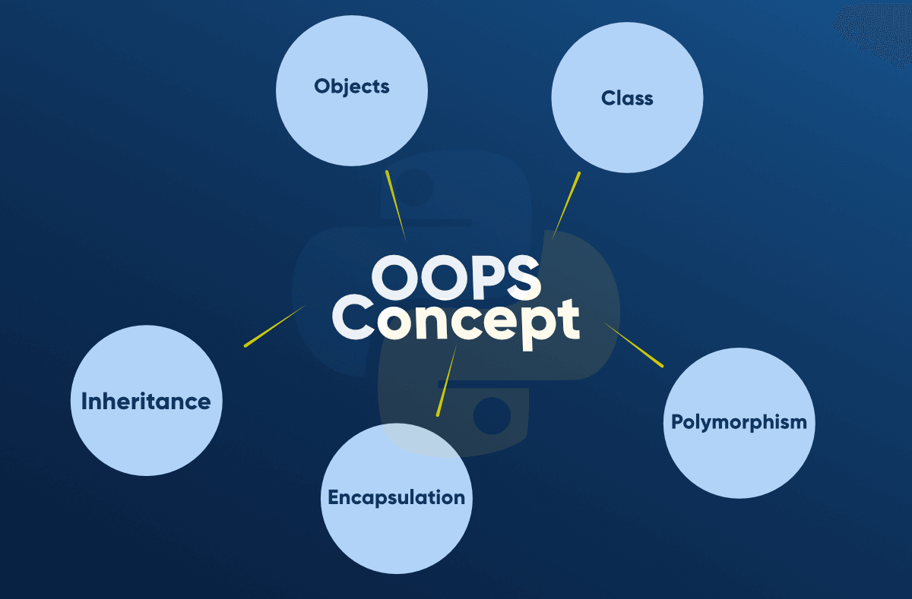

# Object Oriented Programming Concepts

<p align="center">
  
</p>

* Class : A class is a user defined blueprint or prototype from which objects are created. It represents the set of properties or methods that are common to all objects of one type.
```
class Person
{
  string country = "India";
}
```
* Object: It is a basic unit of Object Oriented Programming and represents the real life entities.
* All Objects Have
  * Identity - Coffee Mug
  * Attributes - color, size, fullness
  * Behaviors: fill(), empty(), clean()
* Objects = Noun
    * The Mug
    * The Bank Account
```
class Person
{
  string country = "India";
  
  static void Main(string[] args)
  {
    Person person = new Person();
    Console.WriteLine(person.country);
  }
}
```

* Constructors: It is a special method that is used toinitialize objects. It is called when an object of a class is created. It can be used to set initial values for fields.
```
// Create a class Person
class Person
{
  public int age; // 
  
  // Create a Constructor for the Person class
  public Person()
  {
    age = 25;
  }
  
  static void Main(string[] args)
  {
    Person person = new Person(); // Create an object
    Console.WriteLine(person.age);
  }
}

// Output: 25
```
* **Constructor** is called when the object is created. All classes have constructor by default.

## Four pillers of OOPS

* Abstraction
* Encapsulation
* Inheritence
* Polymorphism

## Abstraction

* Abstraction: It is an act of representing essential features without including background details. It is a technique of creating a new data type that is suited for a specific applications.
    * While driving a car we do not have to be concered with its internal working. Here we need to concern about parts like steering wheels, gears etc.

