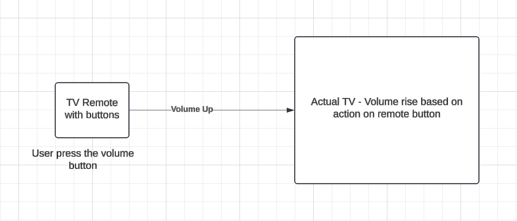

# Abstraction

* Simplifies the programming structure.
* Focus on revealing the necessary details of a system and hiding irrelevant information to minimize its complexity.
* Show what an object does and hides how it doe it.

## Example

<p align="center">
  
</p>


## Implementation of abstraction in Programming Language

* Basic class of a circle:

```C#

class Circle {
    private double radius;
    private double pi;
}

```

* It has two variables, ```radius``` and ```pi```. Now let's add the constructor and functions to calculate the area and perimeter:

```C#

class Circle {
  //define data attributes
  private double radius;
  private double pi;

  //define constructors
  public Circle() {
    radius = 0;
    pi = 3.142;
  }

  public Circle(double r) {
    radius = r;
    pi = 3.142;
  }
  
  //define methods
  public double Area() {
    return pi * radius * radius;
  }
  
  public double Perimeter() {
    return 2 * pi * radius;
  }

  static void Main(string[] args) {
    Circle circle = new Circle(5);
    System.Console.WriteLine("Area: " + circle.Area());
    System.Console.WriteLine("Perimeter: " + circle.Perimeter());
  }
}

```

* We only need to define the radius of the circle in the constructor. After that, the ```area()``` and ```perimeter()``` functions are available to us. This interface is part of encapsulation.

## Abstraction vs Encapsulation

| Abstraction | Encapsulation |
| ----------- | ------------- |
| Focus on the design level of the system | Focus on the application level of the system |
| Hides un-necessary data to simplify the structure | Restrict access to data to prevent this misuse |
| Highlights the work that the object performs | Deals with the internal working of the object |
| Hide implementation using interface and abstract classes | Hide data using getter and setter functions |


**Next:** [➡️ Inheritance](./inheritance.md)
