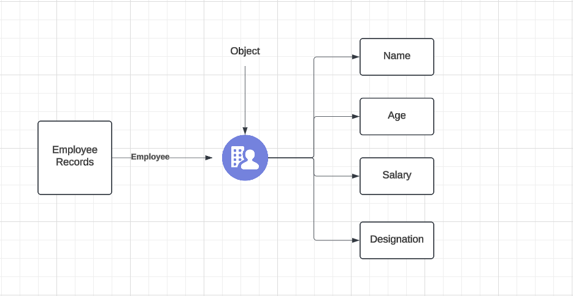
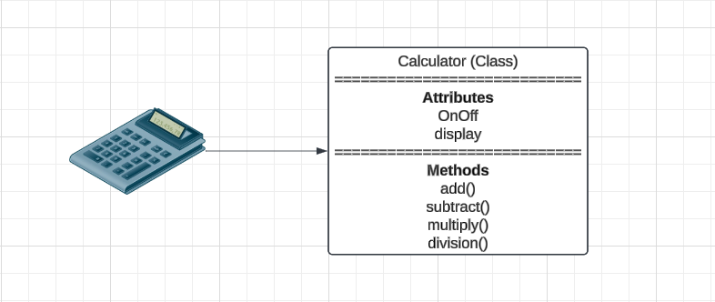

# Cornerstones of Object-Oriented Programming

* It is a programming model that is dependent on the concepts of objects and classes.
* OOP is a programming style, not a tool.
* Every objects has its own unique set of properties.
* These properties are later accessed and modified through the use of various operations.

## Real Life Examples:

  

## Building blocks of OOP

* Attributes
* Methods
* Classes
* Objects

## Examples

* Calculator (Object)
    * State (ON/OFF)
    * Behavior (add, subtract, division etc)
    * Where do objects come from? - Classes
    * Classes - Can be thought of as a blueprint for creating object

## Methods

* Like function that represent the behavior of the object.
* Methods have access to a class attributes.
* They can accept parameters, return values and are used to perform an action on an object of a class.

## Calculator class with Attributes and methods

  

## Principles of OOP

* [Encapsulation](./encapsulation.md)
* [Abstraction](./abstraction.md)
* [Inheritance](./inheritance.md)
* [Polymorphism](./polymorphism.md)
